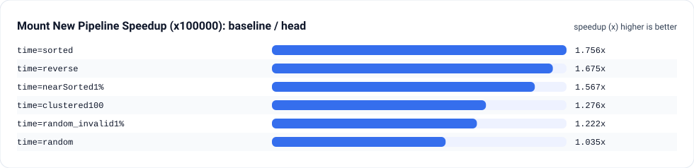
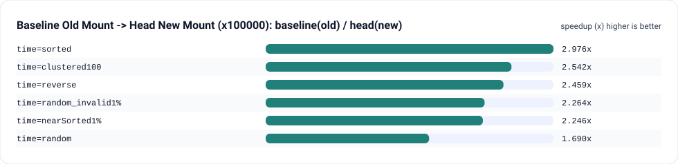
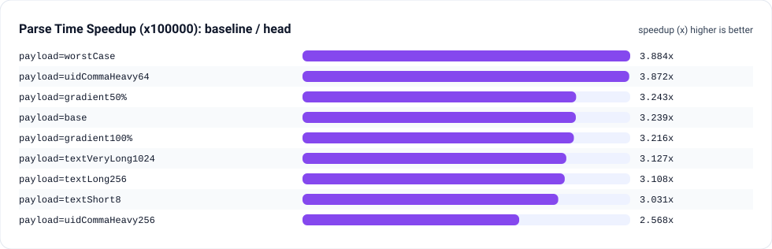
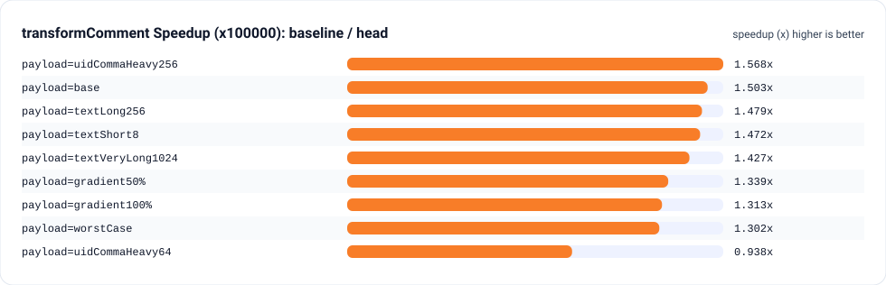

# 装载弹幕性能 Bench 报告（baseline f3aceaf5 vs head c3610135）

这份报告在同一台机器上，用同一套 `vitest bench` 基准用例，对比“装载弹幕关键路径”的 CPU 开销差异。

## 环境信息
- Date: 2026-02-06T19:56:08.061Z
- OS: Windows (PowerShell)
- Node: v22.21.1
- Baseline worktree: D:\_Code\Html Css Javascript\danmaku-anywhere\danmaku-anywhere__baseline_f3aceaf5
- Baseline commit: f3aceaf5
- Head commit: c3610135

## 复现方式
在仓库根目录执行：

```powershell
powershell -NoProfile -ExecutionPolicy Bypass -File scripts\bench\compare-load-bench.ps1
```

脚本会写入这些文件：
- `../danmaku-anywhere__baseline_f3aceaf5/bench-baseline-f3aceaf5.json`
- `bench-head-c3610135.json`
- `bench-compare.md`

## 指标解释
`mount new pipeline` 在本基准里表示：只解析 `time`，构建 `{time, raw}` 列表，检测是否已排序，仅在必要时才排序。
`mount old pipeline` 在本基准里表示：对每条弹幕做一次 `transformComment`（完整解析），然后按 `time` 排序。

## 关键结果（x100000）
| time scenario | mount new baseline (ms) | mount new head (ms) | mount new speedup (x) | mount old speedup (x) | baseline old -> head new (x) |
| --- | --- | --- | --- | --- | --- |
| random | 76.9658 | 74.3327 | 1.035 | 1.574 | 1.690 |
| random_invalid1% | 70.8672 | 57.9972 | 1.222 | 1.466 | 2.264 |
| sorted | 56.2579 | 32.0340 | 1.756 | 1.595 | 2.976 |
| nearSorted1% | 63.6525 | 40.6178 | 1.567 | 1.328 | 2.246 |
| reverse | 67.8884 | 40.5424 | 1.675 | 1.499 | 2.459 |
| clustered100 | 69.1861 | 54.2269 | 1.276 | 1.837 | 2.542 |

Notes:
- `baseline old -> head new` 用来回答：如果你过去在 baseline 上使用“旧式同步装载”（完整解析 + 排序），那么 head 上的“新式装载”能快多少倍。

## 图表速览（x100000）
这些图都来自同一次 `compare-load-bench.ps1` 生成的 `bench-*.json`，值是 `baseline_mean_ms / head_mean_ms`（越大越好）。

### 装载关键路径：新装载（mount new pipeline）


### 装载关键路径：旧装载到新装载（baseline old -> head new）


### 解析 time：不同 payload（parse time）


### 完整解析：不同 payload（transformComment）


## 数据质量说明
- 注意：`parseCommentEntityP payload=worstCase` 没有数值结果（Vitest 输出了空 benchmark 项）。很可能是基准体在遇到 invalid `p`（1%）时抛错，导致这一组结果不可用。

## 时间分布维度：装载与核心步骤（1k/10k/100k）
### mount new pipeline
| metric | baseline mean (ms) | head mean (ms) | speedup (x) | delta (ms) |
| --- | --- | --- | --- | --- |
| mount new pipeline time=random x1000 | 0.3992 | 0.2145 | 1.861 | 0.1847 |
| mount new pipeline time=random x10000 | 5.1108 | 2.9910 | 1.709 | 2.1198 |
| mount new pipeline time=random x100000 | 76.9658 | 74.3327 | 1.035 | 2.6331 |
| mount new pipeline time=random_invalid1% x1000 | 0.4016 | 0.2252 | 1.783 | 0.1764 |
| mount new pipeline time=random_invalid1% x10000 | 5.0730 | 3.0577 | 1.659 | 2.0153 |
| mount new pipeline time=random_invalid1% x100000 | 70.8672 | 57.9972 | 1.222 | 12.8700 |
| mount new pipeline time=sorted x1000 | 0.2348 | 0.0722 | 3.249 | 0.1625 |
| mount new pipeline time=sorted x10000 | 2.5025 | 0.8087 | 3.094 | 1.6937 |
| mount new pipeline time=sorted x100000 | 56.2579 | 32.0340 | 1.756 | 24.2239 |
| mount new pipeline time=nearSorted1% x1000 | 0.2947 | 0.1142 | 2.581 | 0.1805 |
| mount new pipeline time=nearSorted1% x10000 | 3.5846 | 1.3525 | 2.650 | 2.2321 |
| mount new pipeline time=nearSorted1% x100000 | 63.6525 | 40.6178 | 1.567 | 23.0347 |
| mount new pipeline time=reverse x1000 | 0.3167 | 0.1806 | 1.754 | 0.1361 |
| mount new pipeline time=reverse x10000 | 3.4446 | 1.5005 | 2.296 | 1.9441 |
| mount new pipeline time=reverse x100000 | 67.8884 | 40.5424 | 1.675 | 27.3460 |
| mount new pipeline time=clustered100 x1000 | 0.4210 | 0.2377 | 1.771 | 0.1833 |
| mount new pipeline time=clustered100 x10000 | 5.3345 | 3.1148 | 1.713 | 2.2197 |
| mount new pipeline time=clustered100 x100000 | 69.1861 | 54.2269 | 1.276 | 14.9593 |

### mount old pipeline
| metric | baseline mean (ms) | head mean (ms) | speedup (x) | delta (ms) |
| --- | --- | --- | --- | --- |
| mount old pipeline time=random x1000 | 0.6261 | 0.5413 | 1.157 | 0.0848 |
| mount old pipeline time=random x10000 | 7.9723 | 5.4764 | 1.456 | 2.4959 |
| mount old pipeline time=random x100000 | 125.6154 | 79.8127 | 1.574 | 45.8027 |
| mount old pipeline time=random_invalid1% x1000 | 0.7568 | 0.6264 | 1.208 | 0.1304 |
| mount old pipeline time=random_invalid1% x10000 | 9.2436 | 6.8761 | 1.344 | 2.3675 |
| mount old pipeline time=random_invalid1% x100000 | 131.2933 | 89.5473 | 1.466 | 41.7460 |
| mount old pipeline time=sorted x1000 | 0.4968 | 0.3601 | 1.380 | 0.1367 |
| mount old pipeline time=sorted x10000 | 5.3621 | 3.5428 | 1.514 | 1.8193 |
| mount old pipeline time=sorted x100000 | 95.3227 | 59.7792 | 1.595 | 35.5435 |
| mount old pipeline time=nearSorted1% x1000 | 0.5155 | 0.3987 | 1.293 | 0.1169 |
| mount old pipeline time=nearSorted1% x10000 | 6.2842 | 4.3306 | 1.451 | 1.9536 |
| mount old pipeline time=nearSorted1% x100000 | 91.2302 | 68.6796 | 1.328 | 22.5506 |
| mount old pipeline time=reverse x1000 | 0.5484 | 0.4962 | 1.105 | 0.0523 |
| mount old pipeline time=reverse x10000 | 5.9304 | 4.0063 | 1.480 | 1.9240 |
| mount old pipeline time=reverse x100000 | 99.6864 | 66.4952 | 1.499 | 33.1912 |
| mount old pipeline time=clustered100 x1000 | 0.6388 | 0.5466 | 1.169 | 0.0923 |
| mount old pipeline time=clustered100 x10000 | 7.7479 | 5.8585 | 1.323 | 1.8894 |
| mount old pipeline time=clustered100 x100000 | 137.8331 | 75.0380 | 1.837 | 62.7951 |

### build timed (parse time + isSorted detection + filter invalid)
| metric | baseline mean (ms) | head mean (ms) | speedup (x) | delta (ms) |
| --- | --- | --- | --- | --- |
| build timed time=random x1000 | 0.2542 | 0.0752 | 3.380 | 0.1790 |
| build timed time=random x10000 | 2.4412 | 0.7820 | 3.122 | 1.6592 |
| build timed time=random x100000 | 47.7838 | 12.5361 | 3.812 | 35.2477 |
| build timed time=random_invalid1% x1000 | 0.2372 | 0.0763 | 3.107 | 0.1609 |
| build timed time=random_invalid1% x10000 | 2.4414 | 0.8056 | 3.031 | 1.6358 |
| build timed time=random_invalid1% x100000 | 37.8015 | 12.4362 | 3.040 | 25.3653 |
| build timed time=sorted x1000 | 0.2632 | 0.0750 | 3.510 | 0.1882 |
| build timed time=sorted x10000 | 2.4892 | 0.8106 | 3.071 | 1.6786 |
| build timed time=sorted x100000 | 67.9618 | 36.2195 | 1.876 | 31.7423 |
| build timed time=nearSorted1% x1000 | 0.2300 | 0.0760 | 3.026 | 0.1540 |
| build timed time=nearSorted1% x10000 | 2.4995 | 0.8206 | 3.046 | 1.6789 |
| build timed time=nearSorted1% x100000 | 61.3510 | 31.2632 | 1.962 | 30.0878 |
| build timed time=reverse x1000 | 0.2333 | 0.0755 | 3.089 | 0.1577 |
| build timed time=reverse x10000 | 2.6342 | 0.8106 | 3.250 | 1.8236 |
| build timed time=reverse x100000 | 52.7260 | 36.5548 | 1.442 | 16.1712 |
| build timed time=clustered100 x1000 | 0.2395 | 0.0839 | 2.855 | 0.1556 |
| build timed time=clustered100 x10000 | 2.5512 | 0.7941 | 3.213 | 1.7570 |
| build timed time=clustered100 x100000 | 28.6473 | 11.8917 | 2.409 | 16.7556 |

### sort timed (build timed + sort)
| metric | baseline mean (ms) | head mean (ms) | speedup (x) | delta (ms) |
| --- | --- | --- | --- | --- |
| sort timed time=random x1000 | 0.4017 | 0.2240 | 1.793 | 0.1777 |
| sort timed time=random x10000 | 5.0965 | 2.9701 | 1.716 | 2.1264 |
| sort timed time=random x100000 | 94.4813 | 105.4390 | 0.896 | -10.9577 |
| sort timed time=random_invalid1% x1000 | 0.3999 | 0.2315 | 1.727 | 0.1683 |
| sort timed time=random_invalid1% x10000 | 5.0737 | 3.0832 | 1.646 | 1.9906 |
| sort timed time=random_invalid1% x100000 | 109.4407 | 60.3180 | 1.814 | 49.1227 |
| sort timed time=sorted x1000 | 0.3008 | 0.0869 | 3.460 | 0.2139 |
| sort timed time=sorted x10000 | 2.7352 | 0.9791 | 2.794 | 1.7561 |
| sort timed time=sorted x100000 | 65.2665 | 35.3989 | 1.844 | 29.8676 |
| sort timed time=nearSorted1% x1000 | 0.2699 | 0.1191 | 2.265 | 0.1508 |
| sort timed time=nearSorted1% x10000 | 3.1368 | 1.2779 | 2.455 | 1.8589 |
| sort timed time=nearSorted1% x100000 | 67.0181 | 39.4736 | 1.698 | 27.5446 |
| sort timed time=reverse x1000 | 0.3103 | 0.1585 | 1.958 | 0.1518 |
| sort timed time=reverse x10000 | 3.4419 | 1.5021 | 2.291 | 1.9397 |
| sort timed time=reverse x100000 | 66.2219 | 44.0115 | 1.505 | 22.2105 |
| sort timed time=clustered100 x1000 | 0.3999 | 0.2450 | 1.632 | 0.1548 |
| sort timed time=clustered100 x10000 | 5.1200 | 3.1273 | 1.637 | 1.9927 |
| sort timed time=clustered100 x100000 | 68.3262 | 64.4829 | 1.060 | 3.8432 |

### parse time
| metric | baseline mean (ms) | head mean (ms) | speedup (x) | delta (ms) |
| --- | --- | --- | --- | --- |
| parse time time=random x1000 | 0.2221 | 0.0594 | 3.739 | 0.1627 |
| parse time time=random x10000 | 2.3831 | 0.6296 | 3.785 | 1.7535 |
| parse time time=random x100000 | 31.8605 | 6.7421 | 4.726 | 25.1184 |
| parse time time=random_invalid1% x1000 | 0.2241 | 0.0627 | 3.574 | 0.1614 |
| parse time time=random_invalid1% x10000 | 2.3010 | 0.6293 | 3.656 | 1.6716 |
| parse time time=random_invalid1% x100000 | 20.9104 | 7.5400 | 2.773 | 13.3705 |
| parse time time=sorted x1000 | 0.2340 | 0.0632 | 3.705 | 0.1708 |
| parse time time=sorted x10000 | 2.4390 | 0.6584 | 3.705 | 1.7806 |
| parse time time=sorted x100000 | 55.6864 | 36.0100 | 1.546 | 19.6764 |
| parse time time=nearSorted1% x1000 | 0.2230 | 0.0619 | 3.606 | 0.1612 |
| parse time time=nearSorted1% x10000 | 2.4341 | 0.6498 | 3.746 | 1.7843 |
| parse time time=nearSorted1% x100000 | 47.9549 | 23.8488 | 2.011 | 24.1060 |
| parse time time=reverse x1000 | 0.2219 | 0.0635 | 3.498 | 0.1585 |
| parse time time=reverse x10000 | 2.4346 | 0.6343 | 3.838 | 1.8003 |
| parse time time=reverse x100000 | 43.9352 | 30.4438 | 1.443 | 13.4914 |
| parse time time=clustered100 x1000 | 0.2245 | 0.0650 | 3.453 | 0.1595 |
| parse time time=clustered100 x10000 | 2.3272 | 0.6245 | 3.727 | 1.7027 |
| parse time time=clustered100 x100000 | 20.8579 | 6.4707 | 3.223 | 14.3872 |

## Payload 维度：解析与 transform 成本（1k/10k/100k）
### parse time (payload variants)
| metric | baseline mean (ms) | head mean (ms) | speedup (x) | delta (ms) |
| --- | --- | --- | --- | --- |
| parse time payload=base x1000 | 0.2185 | 0.0610 | 3.581 | 0.1575 |
| parse time payload=base x10000 | 2.2299 | 0.6639 | 3.359 | 1.5660 |
| parse time payload=base x100000 | 21.0073 | 6.4853 | 3.239 | 14.5220 |
| parse time payload=uidCommaHeavy64 x1000 | 0.2599 | 0.0621 | 4.189 | 0.1979 |
| parse time payload=uidCommaHeavy64 x10000 | 2.6958 | 0.6971 | 3.867 | 1.9988 |
| parse time payload=uidCommaHeavy64 x100000 | 26.6598 | 6.8859 | 3.872 | 19.7739 |
| parse time payload=uidCommaHeavy256 x1000 | 0.2706 | 0.0626 | 4.322 | 0.2080 |
| parse time payload=uidCommaHeavy256 x10000 | 2.7690 | 0.6761 | 4.095 | 2.0929 |
| parse time payload=uidCommaHeavy256 x100000 | 25.0310 | 9.7472 | 2.568 | 15.2839 |
| parse time payload=textShort8 x1000 | 0.2240 | 0.0615 | 3.642 | 0.1625 |
| parse time payload=textShort8 x10000 | 2.3118 | 0.6420 | 3.601 | 1.6698 |
| parse time payload=textShort8 x100000 | 21.2464 | 7.0105 | 3.031 | 14.2359 |
| parse time payload=textLong256 x1000 | 0.2226 | 0.0617 | 3.605 | 0.1608 |
| parse time payload=textLong256 x10000 | 2.2451 | 0.6492 | 3.458 | 1.5958 |
| parse time payload=textLong256 x100000 | 20.5884 | 6.6250 | 3.108 | 13.9634 |
| parse time payload=textVeryLong1024 x1000 | 0.2327 | 0.0614 | 3.787 | 0.1713 |
| parse time payload=textVeryLong1024 x10000 | 2.2690 | 0.6608 | 3.434 | 1.6082 |
| parse time payload=textVeryLong1024 x100000 | 21.0667 | 6.7381 | 3.127 | 14.3286 |
| parse time payload=gradient50% x1000 | 0.2235 | 0.0637 | 3.505 | 0.1597 |
| parse time payload=gradient50% x10000 | 2.2804 | 0.6355 | 3.589 | 1.6449 |
| parse time payload=gradient50% x100000 | 21.9379 | 6.7650 | 3.243 | 15.1729 |
| parse time payload=gradient100% x1000 | 0.2237 | 0.0619 | 3.615 | 0.1618 |
| parse time payload=gradient100% x10000 | 2.2514 | 0.6601 | 3.411 | 1.5913 |
| parse time payload=gradient100% x100000 | 21.4477 | 6.6686 | 3.216 | 14.7790 |
| parse time payload=worstCase x1000 | 0.2660 | 0.0628 | 4.238 | 0.2032 |
| parse time payload=worstCase x10000 | 2.7523 | 0.6531 | 4.214 | 2.0992 |
| parse time payload=worstCase x100000 | 26.2568 | 6.7609 | 3.884 | 19.4958 |

### parseCommentEntityP (payload variants)
| metric | baseline mean (ms) | head mean (ms) | speedup (x) | delta (ms) |
| --- | --- | --- | --- | --- |
| parseCommentEntityP payload=base x1000 | 0.4090 | 0.2398 | 1.706 | 0.1693 |
| parseCommentEntityP payload=base x10000 | 4.1867 | 2.3447 | 1.786 | 1.8420 |
| parseCommentEntityP payload=base x100000 | 36.2089 | 24.5758 | 1.473 | 11.6331 |
| parseCommentEntityP payload=uidCommaHeavy64 x1000 | 0.4421 | 0.2372 | 1.864 | 0.2050 |
| parseCommentEntityP payload=uidCommaHeavy64 x10000 | 4.5182 | 2.6389 | 1.712 | 1.8793 |
| parseCommentEntityP payload=uidCommaHeavy64 x100000 | 40.1714 | 24.9095 | 1.613 | 15.2619 |
| parseCommentEntityP payload=uidCommaHeavy256 x1000 | 0.4696 | 0.2288 | 2.053 | 0.2409 |
| parseCommentEntityP payload=uidCommaHeavy256 x10000 | 4.6310 | 2.5641 | 1.806 | 2.0670 |
| parseCommentEntityP payload=uidCommaHeavy256 x100000 | 41.9882 | 34.5693 | 1.215 | 7.4189 |
| parseCommentEntityP payload=textShort8 x1000 | 0.4036 | 0.2479 | 1.628 | 0.1557 |
| parseCommentEntityP payload=textShort8 x10000 | 3.9946 | 2.4319 | 1.643 | 1.5627 |
| parseCommentEntityP payload=textShort8 x100000 | 37.7496 | 23.8552 | 1.582 | 13.8944 |
| parseCommentEntityP payload=textLong256 x1000 | 0.4075 | 0.2429 | 1.678 | 0.1646 |
| parseCommentEntityP payload=textLong256 x10000 | 4.0490 | 2.4878 | 1.628 | 1.5611 |
| parseCommentEntityP payload=textLong256 x100000 | 36.5025 | 24.8352 | 1.470 | 11.6673 |
| parseCommentEntityP payload=textVeryLong1024 x1000 | 0.4635 | 0.2380 | 1.947 | 0.2255 |
| parseCommentEntityP payload=textVeryLong1024 x10000 | 4.0896 | 2.5017 | 1.635 | 1.5879 |
| parseCommentEntityP payload=textVeryLong1024 x100000 | 40.7617 | 23.5676 | 1.730 | 17.1941 |
| parseCommentEntityP payload=gradient50% x1000 | 0.4128 | 0.2293 | 1.801 | 0.1836 |
| parseCommentEntityP payload=gradient50% x10000 | 4.0990 | 2.4399 | 1.680 | 1.6590 |
| parseCommentEntityP payload=gradient50% x100000 | 36.3680 | 24.8055 | 1.466 | 11.5625 |
| parseCommentEntityP payload=gradient100% x1000 | 0.4130 | 0.2404 | 1.718 | 0.1727 |
| parseCommentEntityP payload=gradient100% x10000 | 4.6362 | 2.4555 | 1.888 | 2.1807 |
| parseCommentEntityP payload=gradient100% x100000 | 37.6404 | 24.3469 | 1.546 | 13.2935 |
| parseCommentEntityP payload=worstCase x1000 | (no mean) | (no mean) |  |  |
| parseCommentEntityP payload=worstCase x10000 | (no mean) | (no mean) |  |  |
| parseCommentEntityP payload=worstCase x100000 | (no mean) | (no mean) |  |  |

### transformComment (payload variants)
| metric | baseline mean (ms) | head mean (ms) | speedup (x) | delta (ms) |
| --- | --- | --- | --- | --- |
| transformComment payload=base x1000 | 0.4633 | 0.2714 | 1.707 | 0.1919 |
| transformComment payload=base x10000 | 4.6342 | 2.6403 | 1.755 | 1.9939 |
| transformComment payload=base x100000 | 41.7913 | 27.8047 | 1.503 | 13.9865 |
| transformComment payload=uidCommaHeavy64 x1000 | 0.5088 | 0.2706 | 1.880 | 0.2382 |
| transformComment payload=uidCommaHeavy64 x10000 | 5.5239 | 2.9051 | 1.901 | 2.6188 |
| transformComment payload=uidCommaHeavy64 x100000 | 45.8411 | 48.8808 | 0.938 | -3.0397 |
| transformComment payload=uidCommaHeavy256 x1000 | 0.5498 | 0.2736 | 2.010 | 0.2762 |
| transformComment payload=uidCommaHeavy256 x10000 | 5.2288 | 2.8539 | 1.832 | 2.3749 |
| transformComment payload=uidCommaHeavy256 x100000 | 47.4064 | 30.2313 | 1.568 | 17.1751 |
| transformComment payload=textShort8 x1000 | 0.4936 | 0.2795 | 1.766 | 0.2140 |
| transformComment payload=textShort8 x10000 | 4.6789 | 2.8657 | 1.633 | 1.8131 |
| transformComment payload=textShort8 x100000 | 41.1401 | 27.9531 | 1.472 | 13.1870 |
| transformComment payload=textLong256 x1000 | 0.4554 | 0.2921 | 1.559 | 0.1633 |
| transformComment payload=textLong256 x10000 | 4.6923 | 2.7904 | 1.682 | 1.9019 |
| transformComment payload=textLong256 x100000 | 43.1153 | 29.1421 | 1.479 | 13.9732 |
| transformComment payload=textVeryLong1024 x1000 | 0.4918 | 0.2822 | 1.743 | 0.2096 |
| transformComment payload=textVeryLong1024 x10000 | 4.7196 | 2.7704 | 1.704 | 1.9492 |
| transformComment payload=textVeryLong1024 x100000 | 41.5429 | 29.1087 | 1.427 | 12.4343 |
| transformComment payload=gradient50% x1000 | 0.6871 | 0.4480 | 1.533 | 0.2390 |
| transformComment payload=gradient50% x10000 | 7.0730 | 4.6744 | 1.513 | 2.3986 |
| transformComment payload=gradient50% x100000 | 63.2266 | 47.2293 | 1.339 | 15.9973 |
| transformComment payload=gradient100% x1000 | 0.8930 | 0.6248 | 1.429 | 0.2681 |
| transformComment payload=gradient100% x10000 | 9.9384 | 6.3428 | 1.567 | 3.5956 |
| transformComment payload=gradient100% x100000 | 81.0988 | 61.7772 | 1.313 | 19.3215 |
| transformComment payload=worstCase x1000 | 1.0595 | 0.6960 | 1.522 | 0.3635 |
| transformComment payload=worstCase x10000 | 10.8589 | 7.1561 | 1.517 | 3.7028 |
| transformComment payload=worstCase x100000 | 96.9442 | 74.4845 | 1.302 | 22.4597 |

## Episode 聚合：flatMap vs push loop（1k/10k/100k）
| metric | baseline mean (ms) | head mean (ms) | speedup (x) | delta (ms) |
| --- | --- | --- | --- | --- |
| aggregate flatMap episodes=1 x1000 | 0.0115 | 0.0106 | 1.080 | 0.0008 |
| aggregate flatMap episodes=1 x10000 | 0.1044 | 0.1051 | 0.993 | -0.0007 |
| aggregate flatMap episodes=1 x100000 | 2.1715 | 2.0794 | 1.044 | 0.0921 |
| aggregate flatMap episodes=10 x1000 | 0.0116 | 0.0125 | 0.923 | -0.0010 |
| aggregate flatMap episodes=10 x10000 | 0.1054 | 0.1079 | 0.978 | -0.0024 |
| aggregate flatMap episodes=10 x100000 | 2.1364 | 2.3702 | 0.901 | -0.2338 |
| aggregate flatMap episodes=100 x1000 | 0.0126 | 0.0116 | 1.088 | 0.0010 |
| aggregate flatMap episodes=100 x10000 | 0.1084 | 0.1077 | 1.006 | 0.0007 |
| aggregate flatMap episodes=100 x100000 | 2.1397 | 2.4253 | 0.882 | -0.2856 |

| metric | baseline mean (ms) | head mean (ms) | speedup (x) | delta (ms) |
| --- | --- | --- | --- | --- |
| aggregate pushLoop episodes=1 x1000 | 0.0048 | 0.0050 | 0.959 | -0.0002 |
| aggregate pushLoop episodes=1 x10000 | 0.0423 | 0.0444 | 0.952 | -0.0021 |
| aggregate pushLoop episodes=1 x100000 | 1.4017 | 1.4806 | 0.947 | -0.0789 |
| aggregate pushLoop episodes=10 x1000 | 0.0049 | 0.0044 | 1.133 | 0.0006 |
| aggregate pushLoop episodes=10 x10000 | 0.0457 | 0.0430 | 1.063 | 0.0027 |
| aggregate pushLoop episodes=10 x100000 | 1.4409 | 1.5115 | 0.953 | -0.0706 |
| aggregate pushLoop episodes=100 x1000 | 0.0049 | 0.0045 | 1.092 | 0.0004 |
| aggregate pushLoop episodes=100 x10000 | 0.0560 | 0.0461 | 1.214 | 0.0099 |
| aggregate pushLoop episodes=100 x100000 | 1.3976 | 1.4309 | 0.977 | -0.0332 |

## 解读要点
当输入已经有序或接近有序时收益最大，因为装载路径可以跳过完整排序，剩余成本主要是 `time` 解析和构建 timed 数组。
当输入完全随机且规模达到 x100000 时，耗时常常被 `Array.prototype.sort` 主导，所以解析优化对总装载时延的影响会被稀释。
如果你关心“首次装载卡顿”，重点看 `mount new pipeline`。如果你关心“完整解析成本”，重点看 `transformComment`。
